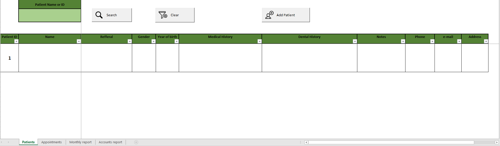
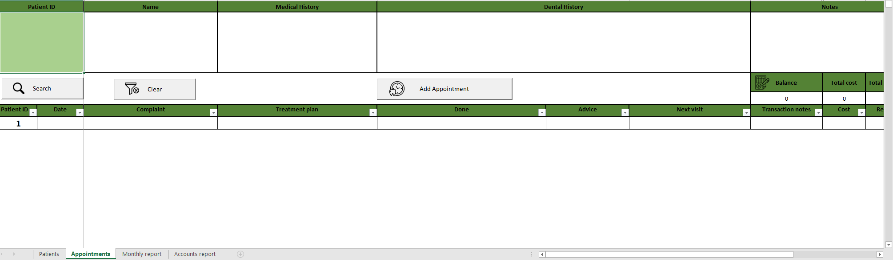
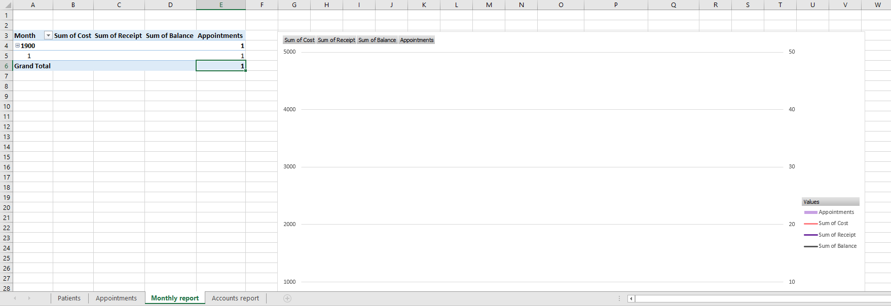
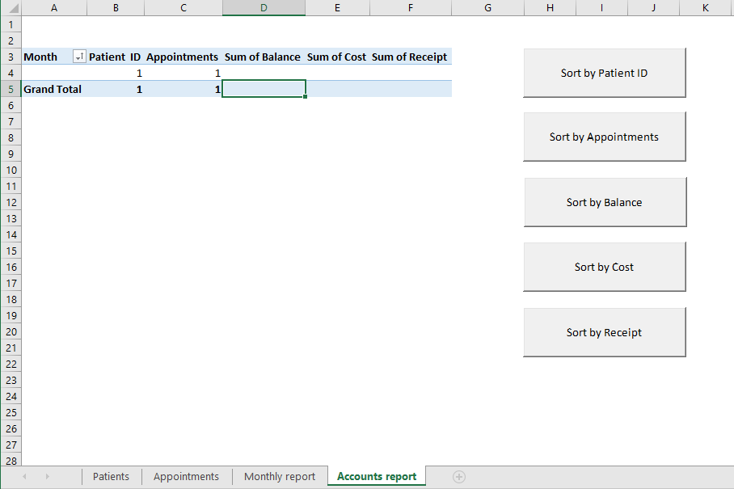

# Dental CRM
Excel CRM solution for dentists.

## Description
A simple excel CRM solution that I have build for a friend of mine who is a dentist. 

The purpose this solution it is to keep track of the static patient's information as well as information about each appointment. The static data for each patient is mainly the medical and dental history and secondary the contact details. For each appointment, the dentist have the ability to enter the complaint, treatment plan, notes and financials. Finally, the reports gives a quick overview of the 

## Features
<ul>
<li>Supports up to a million appointment records (excel rows limit).</li>
<li>Adding new patients and appointment is simple.</li>
<li>The patients can be found via their name or their id using the same search box.</li>
<li>The financial metrics are reflecting the filtered-in records.</li>
<li>By removing the filters, it shows the total revenue and total receipts.</li>
<li>Filtering for a particular patient, it shows the revenue and total receipts for that patient.</li>
<li>The monthly report graphs the financials in which the revenue is displayed against the appointments count.</li>
<li>The accounts report can be sorted in multiple ways with the relevant buttons.</li>
<li>The solution can be easily expanded as per the number of the supported fields.</li>
</ul>

### Patients

### Appointments

### Monthly report

### Accounts report

## Contribute
Pull requests, bug reports, and feature requests are welcome.

## License
This software is under MIT licence.
